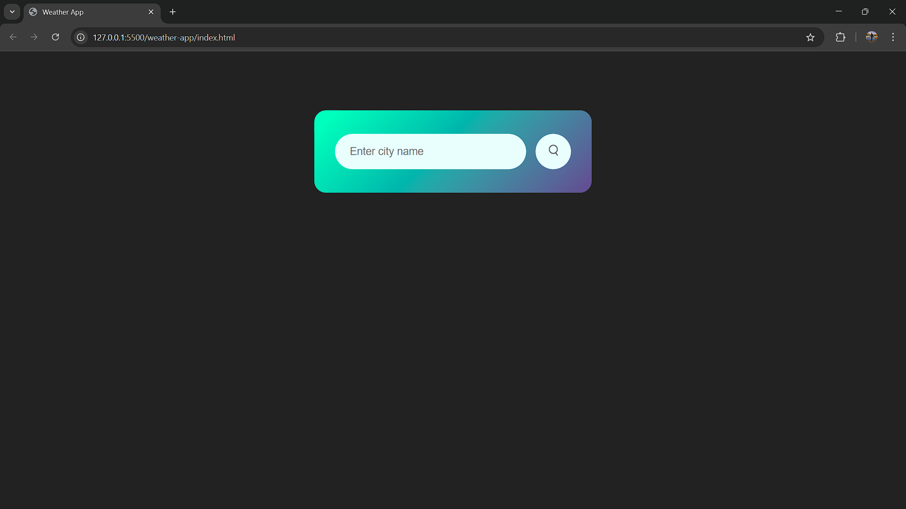
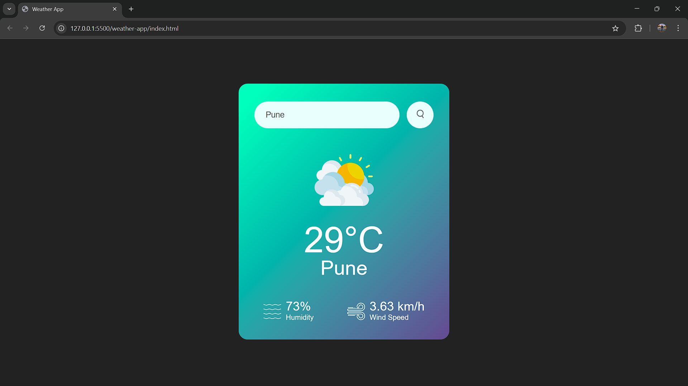
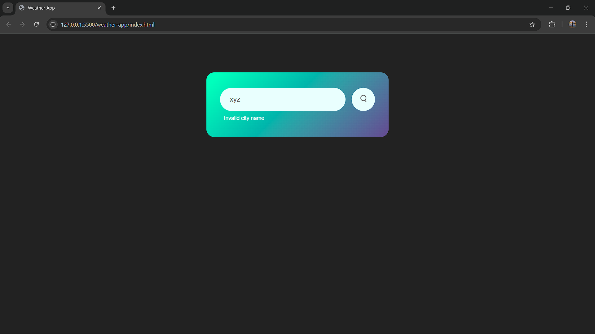

# weather-app

# Description

This is a simple weather app that allows users to search for current weather information of any city. The app fetches weather data from the OpenWeatherMap API and displays details such as temperature, humidity, wind speed, and an appropriate weather icon (e.g., rain, clouds, clear sky).

# Features

Search City: Users can enter a city name to check the weather.

Weather Details: Displays temperature (in °C), humidity, and wind speed.

Dynamic Weather Icons: The app dynamically updates the weather icon based on the current weather (e.g., clear, cloudy, rainy).

Error Handling: Displays an error message if the city name is invalid or the weather data can't be fetched.

Responsive Design: The app is built with a responsive layout that adjusts for different screen sizes.

# Technologies Used

HTML for structure and layout.

CSS for styling and responsive design.

JavaScript for API interaction and dynamic content.

OpenWeatherMap API to fetch real-time weather data.

# Setup

Clone this repository.

Replace the apikey in script.js with your own OpenWeatherMap API key (you can get one from OpenWeatherMap
).

Open the index.html file in a browser to run the app.

## Screenshots

### App Interface
Here are a few screenshots of the app:

  
  
  

